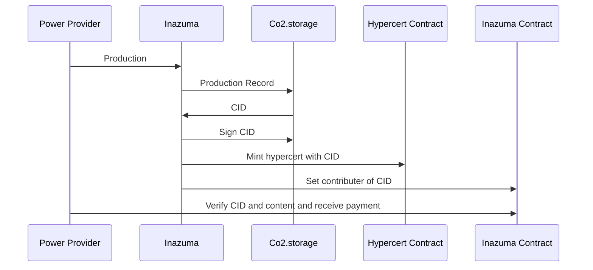
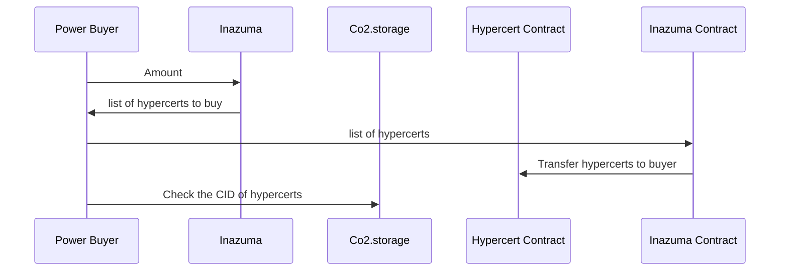

<div align="center">
<h1>Inazuma</h1>

</img>

[](https://github.com/hollow-leaf/inazuma/actions/workflows/ghpage.yml)
[](https://github.com/hollow-leaf/inazuma/actions/workflows/backend.yml)

</div>

### Demo Page

- WebPage: [hollow-leaf.github.io/inazuma](https://hollow-leaf.github.io/inazuma)
- Video: [https://youtu.be/R0JVhL2DiUE?si=Pclr36mrNvYSxCHE](https://youtu.be/R0JVhL2DiUE?si=Pclr36mrNvYSxCHE)
- Inazuma Contract: [0x78E3930D2e258e5E88eC4a7f052ce8c7508d5B3B](https://goerli.etherscan.io/address/0x78E3930D2e258e5E88eC4a7f052ce8c7508d5B3B)

### Abstract

INAZUMA,the gateway to decentralized green energy.We're revolutionizing eco-friendly energy distribution.The purpose of Inazuma is to encourage the use of green energy among humans, reduce CO2 emissions, and protect environment.

### Introduction

The goal of our project is to realize a decentralized green energy platform provider. We use Co2 storage to store and retrieve the acquired green energy metadata, and sell green energy to buyers, who can obtain Hypercerts environmental certification.

Our solution has the following features and advantages:

- Provide incentives to increase the adoption rate of green energy
- Proof of their ESG commitment
- Enable a transparent and publicly accessible process for energy transactions
- Identify enterprises with high electricity consumption that contribute to environmental pollution

### Method

- Use [Co2.Storage](https://co2.storage/) to store green energy metadata
- Use [Hypercerts](https://hypercerts.org/) to mint proof of their ESG commitment
- Use [wagmi](https://wagmi.sh/) and [RainbowKit](https://www.rainbowkit.com/) to build connect wallet button
- Use Node.js express to build backend
- Use Next.js to build frontend

### Technical Architechure

Seller workflow

Buyer workflow

### Build & Installation

> Inazuma is a monorepo managed using turbo. You can find the source code for each package in the `apps/web` and `apps/backend` directory.

- `apps/web` is the web frontend for Inazuma. It is built using [Next.js](https://nextjs.org/).
- `apps/backend` is the web backend for Inazuma.It is built using [AWS EC2](https://aws.amazon.com/ec2/?nc1=h_ls) , [Express](https://expressjs.com/) , [Co2.Storage-api](https://www.npmjs.com/package/@co2-storage/js-api) , [docker](https://www.docker.com/) and [ipfs-unixfs](https://www.npmjs.com/package/ipfs-unixfs).

## Backend Set Up

```bash
cd apps/backend
```

## Setting environment variable

Create a new .env file and add variables as below.
ESTUARY_API_KEY and FG_TOKEN can get from [co2.storage](https://co2.storage/profile).
INFURA_API_KEY get from [Infura](https://app.infura.io/login).
PK: 0x{Your private key}
PKI: Your private key
ADDRESS: Your address

```
ESTUARY_API_KEY=
INFURA_API_KEY=
PK=
FG_TOKEN=
ADDRESS=
PKI=
```

## Deploy the contract

```bash
cd src/contracts
```

There are two contracts in the folder, we have to deploy both of them.

### Greencoin contract

- Deploy Greencoin.sol and record the contract’s address.
- Mint enough Greencoin to use.

### Inazuma contract

- Change the _greencoin_address

```solidity
address constant _greencoin_address = //Your Greencoin contract address;
```

- Deploy the contract

### After deploying both of contract

- Go [hypercert contract](https://goerli.etherscan.io/address/0x822F17A9A5EeCFd66dBAFf7946a8071C265D1d07#writeProxyContract) and set setApprovalForAll to your contract address. This makes your contract can transfer hypercert you mint.
    
- In the Greencoin contract, set approve to your Inazuma contract. This makes Inazuma contract can transfer your greencoin to provider as payment.

## Setting Code

### blockchain.js

```bash
cd ..
cd blcokchain
```

There is blockchain.js here and edit inazuma inside to your inazuma contract address.

```bash
cd ..
cd blcokchain
```

### contract.ts and api.ts

Go apps/web/service from root of project you can find contract.ts and api.ts. First, in contract,ts edit contract address to your inazuma contract address in line 111. Next, open api.ts and set host as “http://127.0.0.1:8080”.

```
const inazuma ="0x65....c35";
const hypercert="0x82....d07";
```
### **********greenCoinBalance.tsx**********

Go apps/web/components from root of project and find **********greenCoinBalance.tsx**********, and edit address variable to your greencoin contract address.

## Final
you can run:
```
turbo dev
```
now Inazuma is displayed.
### Contributors

- Backend + Inazuma Contract: [SoloLin](https://github.com/LinXJ1204)
- Frontend: [JakeKuo](https://github.com/crypto0627)
- Frontend: [EricLin](https://github.com/EricLin0619)
- CI/CD + technology support: [kidneyweakx](https://github.com/kidneyweakx)
